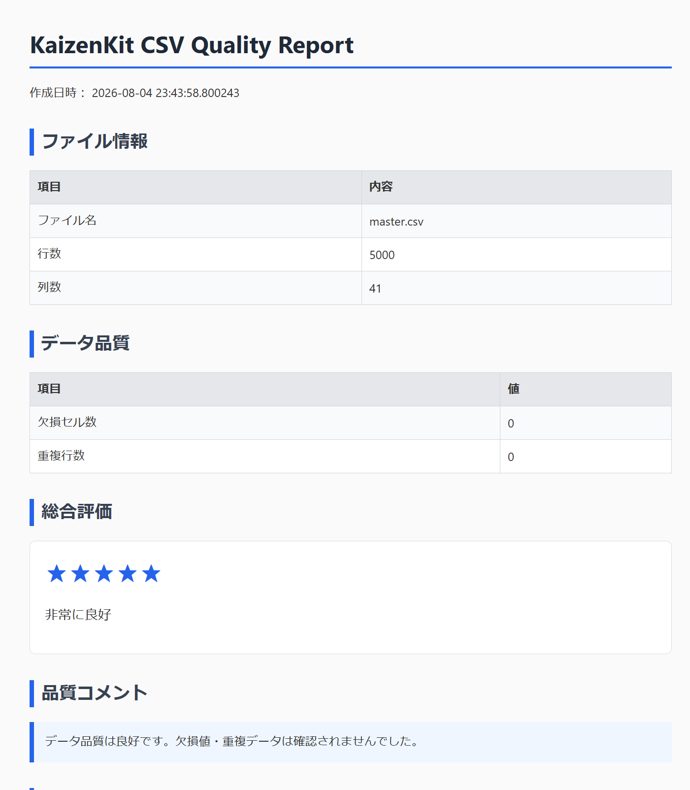

# KaizenKit CSV

CSVデータ整理・品質チェックを簡単にする無料ツール

KaizenKit CSVは、日々のCSV作業を効率化するWindows向けデスクトップアプリです。

大量のCSVデータ確認、重複チェック、品質確認を簡単に行えます。

---

## 主な機能

✓ CSVファイル読み込み

✓ 重複行チェック

✓ 重複行削除

✓ 欠損データ確認

✓ 列ごとのデータ分析

✓ 数値データ統計表示

✓ HTML品質レポート出力

✓ Windows対応

---

## スクリーンショット

（ここに画像を追加予定）

### メイン画面

### CSV分析結果

### 品質レポート

---

# ダウンロード方法

最新版はGitHub Releasesからダウンロードできます。

## Windows版

1. Releaseページを開く

2. `KaizenKit CSV.exe` をダウンロード

3. ダウンロードしたファイルを起動

※ Pythonのインストールは不要です。

---

# 使い方

## 1. CSVを開く

アプリを起動し、

「CSVを開く」

ボタンからCSVファイルを選択します。

## 2. データを確認

読み込んだCSVについて以下を確認できます。

- ファイル情報
- 行数
- 列数
- 欠損データ
- 重複行
- 列情報
- 数値統計

## 3. 重複削除

重複したデータを確認し、不要な行を削除できます。

## 4. 品質レポート出力

「品質レポート出力」

からHTML形式のレポートを作成できます。

ブラウザで確認可能です。

---

# 動作環境

## 対応OS

Windows 10 / Windows 11

## 必要環境

通常利用ではPython環境は不要です。

---

# フィードバック

KaizenKit CSVへの改善要望や不具合報告を歓迎しています。

以下からお願いします。

## GitHub Issue

（Issue URLを追加）

または

## Googleフォーム

（フォームURLを追加）

---

# 今後の予定

今後、以下の機能追加を予定しています。

- CSV結合
- CSV分割
- CSV比較
- CSV変換
- より高度なデータ分析機能

---

# ライセンス

License: MIT License

---

# 開発

KaizenKit

CSV作業をもっとシンプルに。
